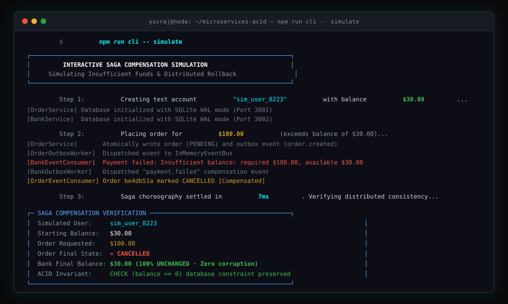

<p align="center">
  
</p>

<p align="center">
  <a href="https://github.com/YuvvrajSingh/microservices-acid"></a>
  <a href="https://github.com/YuvvrajSingh/microservices-acid"></a>
  <a href="https://github.com/YuvvrajSingh/microservices-acid"></a>
  <a href="https://github.com/YuvvrajSingh/microservices-acid"></a>
  <a href="https://github.com/YuvvrajSingh/microservices-acid"></a>
</p>

# microservices-acid

Event-driven microservices architecture in TypeScript demonstrating local ACID guarantees, dual-write prevention via the Transactional Outbox pattern, and Saga choreography with compensating transactions.

---

## Architecture Overview

In a distributed system, individual microservices maintain private databases. Coordinating mutations across service boundaries without blocking two-phase commits requires local atomicity and asynchronous event choreography.

```
[Client]
   │
   ▼ POST /orders
┌─────────────────────────────────┐
│          Order Service          │
│  ─────────────────────────────  │
│  Local ACID Transaction:        │
│   · INSERT INTO orders (PENDING)│
│   · INSERT INTO outbox (event)  │
└─────────────────────────────────┘
                │
                ▼ Outbox Worker
     ┌─────────────────────┐
     │  InMemory EventBus  │ (at-least-once delivery)
     └─────────────────────┘
                │
                ▼ Consumer (`order.created`)
┌─────────────────────────────────┐
│           Bank Service          │
│  ─────────────────────────────  │
│  Local ACID Transaction:        │
│   · Check inbox (Idempotency)   │
│   · Check CHECK(balance >= 0)   │
│   · UPDATE accounts balance     │
│   · INSERT INTO transactions    │
│   · INSERT INTO outbox (status) │
└─────────────────────────────────┘
                │
                ▼ Outbox Worker
     ┌─────────────────────┐
     │  InMemory EventBus  │
     └─────────────────────┘
                │
                ▼ Consumer (`payment.succeeded` / `payment.failed`)
┌─────────────────────────────────┐
│          Order Service          │
│  ─────────────────────────────  │
│  Local Transaction:             │
│   · Succeeded -> COMPLETED      │
│   · Failed    -> CANCELLED      │
│     (Saga Compensation)         │
└─────────────────────────────────┘
```

### Core Invariants

1. **Private Databases & Storage Isolation**: Each microservice manages its own SQLite database (`services/order-service/order.db` and `services/bank-service/bank.db`). There are zero cross-database queries, shared locks, or distributed 2PC transactions.
2. **Dual-Write Prevention (Transactional Outbox)**: State changes and outbound domain events commit in the same local database transaction. Network failures cannot leave an entity saved without its corresponding event.
3. **Failure Isolation & Outbox Buffering**: If a downstream service crashes or goes offline, the calling service continues accepting transactions locally. Outbound events buffer safely in the local outbox until the downstream service recovers.
4. **At-Least-Once Delivery**: Polling workers read pending outbox entries and publish them to the event bus with retry logic.
5. **Consumer Idempotency (Inbox Pattern)**: Consumers record received event IDs in an `inbox` table. Duplicate messages delivered over the wire are discarded before state mutation.
6. **Saga Compensation**: When a debit violates business constraints (e.g. insufficient balance), the Bank emits `payment.failed`. The Order Service handles this by updating the order status to `CANCELLED`.
7. **Database-Level Invariants**: Account tables declare `CHECK (balance >= 0)` to guarantee balance integrity at the storage layer.

---

## Directory Layout

```
microservices-acid/
├── shared/                       # Shared contracts and messaging infrastructure
│   ├── types.ts                  # Domain events, order states, outbox models
│   ├── eventBus.ts               # Asynchronous event broker with wildcard subscriptions
│   └── index.ts                  # Shared exports
├── services/
│   ├── order-service/            # Order creation & lifecycle management
│   │   ├── order.db              # Dedicated SQLite WAL database for Order Service
│   │   ├── src/
│   │   │   ├── db.ts             # SQLite WAL connection, orders + outbox schema
│   │   │   ├── app.ts            # REST API (Port 3001)
│   │   │   ├── outboxWorker.ts   # Background outbox publisher
│   │   │   └── eventConsumer.ts  # Saga consumer (payment outcomes)
│   │   └── test/                 # Service-level unit tests
│   └── bank-service/             # Account ledger & balance management
│       ├── bank.db               # Dedicated SQLite WAL database for Bank Service
│       ├── src/
│       │   ├── db.ts             # Accounts schema with CHECK (balance >= 0)
│       │   ├── api.ts            # REST API (Port 3002)
│       │   ├── outboxWorker.ts   # Background outbox publisher
│       │   └── eventConsumer.ts  # Debit consumer with inbox deduplication
│       └── tests/                # Service-level unit tests
├── test/
│   └── e2eChoreography.test.ts   # End-to-end multi-service choreography suite
├── cli.ts                        # Interactive & scripted developer CLI
└── assets/                       # Vector screenshot and design assets
```

---

## Quickstart

### Prerequisites

- Node.js 18+ (tested on Node.js 24)
- npm 9+

### Installation

```bash
git clone https://github.com/YuvvrajSingh/microservices-acid.git
cd microservices-acid
npm install
```

### Running Tests

Execute the 33-test automated suite covering unit tests, HTTP endpoints, constraint rollbacks, and end-to-end choreography:

```bash
npm test
```

---

## CLI Usage

The project includes an interactive terminal interface and scriptable subcommands.

### Interactive Menu

```bash
npm run cli
```

Provides a numbered console interface for managing accounts, placing orders, triggering outbox polling, and inspecting raw database tables:
- **Option 5**: Trace distributed transaction (live topology diagram + saga step timeline).
- **Option 8**: Inspect Outbox & Inbox tables (side-by-side split-pane comparison).
- **Option 9**: Simulate insufficient funds rollback (Saga compensation).
- **Option 10**: Simulate stopping a service (takes Bank Service offline, buffers order in outbox, restarts Bank Service, and verifies eventual consistency).

### Non-Interactive Commands

```bash
# 1. Live trace a distributed transaction with architecture topology & saga timeline
npm run cli -- trace alice 40

# 2. Create a bank account with $100 initial balance
npm run cli -- create-account alice 100

# 3. Deposit additional funds
npm run cli -- deposit alice 50

# 4. Check account balance and ledger history
npm run cli -- balance alice

# 5. Place an order (triggers outbox -> broker -> bank debit -> saga completion)
npm run cli -- order alice 40

# 6. Check order status
npm run cli -- status <order-id>

# 7. Inspect Outbox and Inbox tables across both microservices (Split-Pane view)
npm run cli -- inspect

# 8. Run automated saga compensation simulation (insufficient funds rollback)
npm run cli -- simulate

# 9. Run service outage and outbox recovery simulation
npm run cli -- simulate-stop
```

---

## Service Endpoints

When started via `npx tsx cli.ts start`, services expose HTTP endpoints:

### Order Service (Port 3001)

| Method | Endpoint | Description |
| :--- | :--- | :--- |
| `POST` | `/orders` | Create an order (`userId`, `amount`) |
| `GET` | `/orders/:id` | Get order status by ID |
| `GET` | `/orders` | List recent orders |
| `GET` | `/outbox` | View outbox records |
| `POST` | `/outbox/process` | Trigger outbox publishing worker |
| `GET` | `/inbox` | View processed event IDs |

### Bank Service (Port 3002)

| Method | Endpoint | Description |
| :--- | :--- | :--- |
| `POST` | `/accounts` | Create account (`userId`, `initialBalance`) |
| `GET` | `/accounts/:userId` | View account details |
| `POST` | `/accounts/:userId/deposit` | Deposit funds |
| `GET` | `/accounts/:userId/transactions` | View audit ledger |
| `GET` | `/outbox` | View outbox records |
| `POST` | `/outbox/process` | Trigger outbox publishing worker |
| `GET` | `/inbox` | View processed event IDs |

---

## License

ISC
